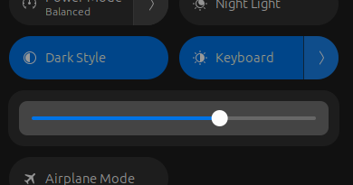

# Samsung Galaxybook Extras ⚠️(WIP)⚠️

Samsung Galaxybook Extras Linux platform driver and accompanying systemd hwdb mappings.

Current status: ⚠️ **WIP but nearing readiness for mainline** ⚠️ (use at your own risk!)

The intent is to somewhat replicate in Linux what Samsung has done in Windows with what I think the following components are doing:

- **Samsung System Event Controller**: an ACPI driver that interacts with their `SCAI` ACPI device in order to control a lot of these settings.
- **Samsung System Support Engine**: a service which in turn starts the background program `SamsungSystemSupportEngine.exe` which seems to handle quite a lot of things on the userspace/application side, including:
  - setting some last-known values at start time (Performance mode, possibly others?),
  - automatically turning off and on the keyboard backlight based on a configured idle time,
  - displaying OSD notifications upon hotkey presses,
  - etc
- **Samsung Settings**: GUI application to configure all of the different available features.

## Platform Driver

This is a new and (currently) completely out-of-tree kernel platform driver intended to mimic what the **Samsung System Event Controller** Windows system device driver seems to be doing (namely, communicate with the `SCAI` ACPI device in order to control these extra features). Once more features have been added and it has been tested then my intention is to try and submit the driver to be added to the kernel.

The following features are currently implemented:

- Support for hotkey handling
- Keyboard backlight
- Battery saver percent (stop charging battery at given percentage value)
- Start device automatically when opening lid
- USB ports provide charging when device is turned off
- Toggle to allow or block recording from the built-in camera and microphone
- Fan speed monitoring via `fan_speed_rpm` sysfs attribute plus a new hwmon device
- Performance mode (Performance, Optimized, Quiet, Silent) implemented as platform profiles

The following features might be possible to implement but require  additional debugging and development:

- "Dolby Atmos" mode for the speakers

### Supported devices

The devices supported by this platform driver should be any device where `sudo dmidecode --type 3` reports `Manufacturer: SAMSUNG ELECTRONICS CO., LTD.` and `Type: Notebook`, PLUS that the ACPI device `SCAI` is present with ACPI Device IDs matching the list given in the driver (`SAM0427`, `SAM0428`, and `SAM0429` at the time of this writing). This covers most of the currently available "Samsung Galaxy Book" series notebooks, but could include others as well.

Note that for the devices with the ACPI Device ID `SAM0427`, there will currently not be support for:
- Performance mode
- Fan speed
- Hotkey support

If you have a device with `SAM0427` and wish to help provide support to overcome the above limitations, please feel free to create an issue!

### Module Parameters

The platform driver supports the following module parameters:

- `kbd_backlight`: Enable Keyboard Backlight control (default on) (bool)
- `performance_mode`: Enable Performance Mode control (default on) (bool)
- `fan_speed`: Enable fan speed (default on) (bool)
- `i8042_filter`: Enable capturing keyboard hotkey events (default on) (bool)
- `acpi_hotkeys`: Enable ACPI hotkey events (default on) (bool)
- `wmi_hotkeys`: Enable WMI hotkey events (default on) (bool)
- `debug`: Enable debug messages (default off) (bool)

In general the intention of these parameters is to allow for enabling or disabling of various features provided by the driver, especially in cases where a particular feature does not appear to work with your device. The availability of the various "settings" flags (`battery_saver_percent`, `start_on_lid_open`, etc) will always be enabled and cannot be disabled at this time.

> **Note:** Please raise an issue if you find that you need to disable a certain feature in order to avoid a problem that it causes with your device!

### Building and installing

Compile the module out-of-tree but against the currently loaded kernel's modules:

```sh
make -C /lib/modules/`uname -r`/build M=$PWD
```

Install this module into your currently loaded kernel's modules:

```sh
sudo make -C /lib/modules/`uname -r`/build M=$PWD modules_install
sudo depmod
```

> *Note:* if you wish to enable `debug` by default then you can add `samsung_galaxybook.debug=true` to your boot parameters.

Load the module (including enabling debugging messages):

```sh
sudo modprobe samsung-galaxybook debug=true
```

Unload the module:

```sh
sudo rmmod samsung-galaxybook
```

Uninstall the module:

```sh
sudo rm /lib/modules/`uname -r`/updates/samsung-galaxybook.ko
```

#### How to avoid 'signature and/or required key missing'

If you want to sign the driver to avoid the message `samsung_galaxybook: module verification failed: signature and/or required key missing - tainting kernel`, then you will need to sign the module following whatever process is typical for your distribution. For Debian-based distrubutions (including Ubunutu), you can install the `linux-source` package for your current kernel and used the included keys and scripts to sign the module as follows:

```sh
sudo rmmod samsung-galaxybook

/usr/src/`uname -r`/debian/scripts/sign-module sha512 /usr/src/`uname -r`/debian/certs/signing_key.pem /usr/src/`uname -r`/debian/certs/signing_key.x509 samsung-galaxybook.ko

sudo cp samsung-galaxybook.ko /lib/modules/`uname -r`/updates/samsung-galaxybook.ko

sudo modprobe samsung-galaxybook debug=true
```

#### Enable or disable features using parameters

The module parameters can be used to enable or disable most features. For example, the following would reload the module with only the core settings flags (`battery_saver_percent`, `start_on_lid_open`, etc) and the kbd_backlight LED class, and all other features would be disabled:

```sh
sudo rmmod samsung-galaxybook
sudo modprobe samsung-galaxybook debug=false kbd_backlight=on performance_mode=off fan_speed=off i8042_filter=off acpi_hotkeys=off wmi_hotkeys=off
```

Note that these can also be added to the boot parameters (e.g. `samsung_galaxybook.fan_speed=off`).

### General observations

One general observation that I have made is that there are in fact quite a lot of bugs in Samsung's firmware for these devices, for example:

- Exceptions thrown from the firmware itself when certain ACPI methods are executed (both in Windows and in Linux)
- ACPI specification has not been followed 100% in some cases (mismatched method signatures e.g. wrong data types for parameters and return values, missing fields or methods, etc)
- etc

It would be great if we could actually get some help from Samsung regarding this!

### Hotkeys

Samsung have decided to use the main keyboard device to also send most of the hotkey events. If the driver wishes to capture and act on these hotkeys, then we will have to do something like using a i8402 filter to "catch" the key events.

I have also found that some of the hotkey events have conflicts so it is a bit of a tricky territory.

#### Keyboard backlight hotkey (Fn+F9)

The keyboard backlight hotkey will cycle through all available backlight brightness levels in a round-robin manner, starting again at 0 when the maximum is reached (i.e. 0, 1, 2, 3, 0, 1, ...).

The action will be triggered on keyup of the hotkey as the event reported by keydown seems to be the same event for battery charging progress (and thus things get a little crazy when you start charging!).

The hotkey should also trigger the hardware changed event for the LED, which in GNOME (and likely others) automatically displays a nice OSD popup with the correct baclight level displayed.

#### Performance mode hotkey (Fn+F11)

The performance mode hotkey will also cycle through all available platform profiles in a round-robin manner (low-power, quiet, balanced, performance, low-power, quiet, ...).

There is currently no OSD popup but the event can be captured from the "Samsung Galaxybook extra buttons" input device if desired.

### Keyboard backlight

A new LED class called `samsung-galaxybook::kbd_backlight` is created which can be controlled via `sysfs` at `/sys/class/leds/samsung-galaxybook::kbd_backlight/brightness` (values 0 to 3) or by many of the standard utilities such as `brightnessctl`, `light`, etc.

It also seems to be picked up automatically in GNOME 45.x in the panel, where you can click the arrow beside `Keyboard` and adjust the slider:



Note that the setting "automatically turn off the keyboard backlight after X seconds" in Windows is actually controlled by Samsung's application service and not by the device driver itself; there is a similar feature in GNOME (and again, likely others) where it toggles to the minimum level after a certain idle period (e.g. from 3 to 1 when you are idle, and then back to 3 when you resume), but regardless this feature should probably be controlled in the userspace somehow and not by the kernel driver.

Also note that most of these devices have an ambient light sensor which also affects the keyboard backlight. This behavior is not possible to control in Windows and I have not yet found anything in the ACPI that seems to be able to disable this feature. What this means is that sometimes you might think that the keyboard backlight is just randomly turning off or has stopped working, but the reality is that it is turning off due to this ambient light sensor. One way to test when this happens (to be sure that it is in fact the ambient light sensor which has caused the keyboard backlight to turn off) is to just cover the sensor somehow (with your finger, for example), and see if the lights come back on.

### Battery saver percent

The "Battery saver" feature will stop the battery charging at a given percentage. If the user wishes to maintain interoperability with Windows, then they should set the value to 80 to represent "on", or 0 to represent "off", as these are the values recognized by the various Windows-based Samsung applications and services as "on" or "off". Otherwise, the device will accept any value between 0 (off) and 99 as a percentage that you wish the battery to stop charging at. If you try to set a value of 100, the driver will also accept this input, but just set the attribute value to 0 (i.e. 100% is interpreted as "turn battery saver off").

There is a new device attribute created at `/sys/devices/platform/samsung-galaxybook/battery_saver_percent` which can be read from or written to.

```sh
# read current value (percentage the battery will stop charging)
cat /sys/devices/platform/samsung-galaxybook/battery_saver_percent

# turn on and set to 80%
echo 80 | sudo tee /sys/devices/platform/samsung-galaxybook/battery_saver_percent

# turn off battery saver so that charging will not be stopped before 100%
echo 0 | sudo tee /sys/devices/platform/samsung-galaxybook/battery_saver_percent
```

> **Note:** I have noticed that if you are currently plugged while the battery is already sitting at the desired `battery_saver_percent`, then turn off this feature (i.e. you wish to charge fully to 100% so you set the value to 0), charging does not seem to start automatically. It may be necessary to disconnect and reconnect the charging cable in this case. The Windows driver seems to be doing some hocus-pocus with the ACPI battery device that I have not quite sorted out yet; I am assuming this is how they made it work more seamlessly in Windows?

There is also an input event sent to the standard keyboard and ACPI device which is generated when battery saver is enabled and charging reaches the desired `battery_saver_percent`; the input has been mapped to the `BATTERY` event so that notifications can be displayed (see below in the keyboard remapping section for additional information on this).

### Start on lid open

To turn on or off the "Start on lid open" setting (the laptop will power on automatically when opening the lid), there is a new device attribute created at `/sys/devices/platform/samsung-galaxybook/start_on_lid_open` which can be read from or written to. A value of 0 means "off" while a value of 1 means "on".

```sh
# read current value (0 for disabled, 1 for enabled)
cat /sys/devices/platform/samsung-galaxybook/start_on_lid_open

# turn on (supports values such as: 1, on, true, yes, etc)
echo true | sudo tee /sys/devices/platform/samsung-galaxybook/start_on_lid_open

# turn off (supports values such as: 0, off, false, no, etc)
echo 0 | sudo tee /sys/devices/platform/samsung-galaxybook/start_on_lid_open
```

### USB Charging mode

To turn on or off the "USB Charging" mode (allows USB ports to provide power even when the laptop is turned off), there is a new device attribute created at `/sys/devices/platform/samsung-galaxybook/usb_charging` which can be read from or written to. A value of 0 means "off" while a value of 1 means "on".

```sh
# read current value (0 for disabled, 1 for enabled)
cat /sys/devices/platform/samsung-galaxybook/usb_charging

# turn on (supports values such as: 1, on, true, yes, etc)
echo true | sudo tee /sys/devices/platform/samsung-galaxybook/usb_charging

# turn off (supports values such as: 0, off, false, no, etc)
echo 0 | sudo tee /sys/devices/platform/samsung-galaxybook/usb_charging
```

My own observations on how this feature appears to work (which has nothing to do with this driver itself, actually):

- Only the USB-C ports are impacted by this setting, and not the USB-A ports (at least this is the case on the Galaxy Book2 Pro).
- When the setting is turned on and you plug in a mobile phone or similar to one of the USB-C ports, then the phone will begin charging from the laptop's battery.
- When the setting is turned off and you plug in a mobile phone, the laptop battery will actually start charging from the phone's battery.

### Allow recording

To turn on or off the "Allow recording" setting (allows or blocks usage of the built-in camera and microphone), there is a new device attribute created at `/sys/devices/platform/samsung-galaxybook/allow_recording` which can be read from or written to. A value of 0 means "off" while a value of 1 means "on".

The Samsung user manual calls this setting "Blocking Recording mode", but as the value needed is 1 for "not blocked" and 0 for "blocked" (i.e. the value of 1 vs 0 feels "backwards" compared to the name), it felt like something of a misnomer to call it that for this driver. It seems to make more sense that 1 means "allowed" and 0 means "not allowed"; this way, it is hopefully more obvious to the user of this driver what will actually happen when this value is changed.

```sh
# read current value (0 for disabled, 1 for enabled)
cat /sys/devices/platform/samsung-galaxybook/allow_recording

# turn on (supports values such as: 1, on, true, yes, etc)
echo true | sudo tee /sys/devices/platform/samsung-galaxybook/allow_recording

# turn off (supports values such as: 0, off, false, no, etc)
echo 0 | sudo tee /sys/devices/platform/samsung-galaxybook/allow_recording
```

### Fan speed

Samsung has implemented the standard ACPI method `_FST` for the fan device, but not the other optional methods in the ACPI specification which would cause the kernel to automatically add the `fan_speed_rpm` attribute. On top of this, it seems that there are some bugs in the firmware that throw an exception when you try to execute this ACPI method. This behavior is also seen in Windows (that an ACPI exception is thrown when the fan speed is attempted to be checked), and I have not been able to see fan speeds using various hardware monitoring applications while using Windows with this device.

However, I believe I have succeeded in figuring out roughly the intention of how their `_FST` method is supposed to work:

1. There is a data package `FANT` ("fan table"??) which seems to be some kind of list of possible RPM speeds that the fan can operate at for each different "level" (0 through 5).
2. There is a data field on the embedded controller called `FANS` ("fan speed"??) which seems to give the current "level" that the fan is operating at.

I have **assumed** that the values from `FANT` are integers which represent the actual RPM values (they seem reasonble, anyway), but can't be one-hundred percent certain that this assumption is correct. It would be interesting to get confirmation from Samsung or if someone has a way to measure the actual speed of the fan.

The fan can either be completely off (0) or one of the levels represented by the speeds in `FANT`. This driver reads the values in from `FANT` instead of hard-coding the levels with the assumption that it could be different values and a different number of levels for different devices. For reference, the values I see with my Galaxy Book2 Pro are:

- 0x0 (0)
- 0xdac (3500)
- 0xee2 (3820)
- 0x1144 (4420)
- 0x127a (4730)

On top of this, in Samsung's `_FST` method it seems to be adding `0x0a` (10) to each value before trying to report them, and that level 3 and 4 should have the same value, while level 5 should be the 4th value from `FANT`. However, real-life observation suggests that level 3 and 4 are in fact different, and that level 5 seems to be significantly louder than level 4. Due to this, this driver will just "guess" that levels 3 and 4 are actually as is listed in `FANT`, and that the last level is maybe 1000 RPM faster than level 4 (unless anyone can find something better than this!).

The fan speed can be monitored using hwmon sensors or by reading the `fan_speed_rpm` sysfs attribute.

```sh
# read current fan speed rpm from sysfs attribute
cat /sys/bus/acpi/devices/PNP0C0B\:00/fan_speed_rpm

# read current fan speed rpm from hwmon device
sensors
```

### Performance mode

To modify the "performance mode", the driver implements the [`platform_profile` interface](https://www.kernel.org/doc/html/latest/userspace-api/sysfs-platform_profile.html). The following strings can be written to `/sys/firmware/acpi/platform_profile` to set the performance mode:

- `low-power` (Silent)
- `quiet` (Quiet)
- `balanced` (Optimized, default value if not set)
- `performance` (Performance)

Examples:

```sh
# Get supported performance modes
cat /sys/firmware/acpi/platform_profile_choices

# set performance_mode to low-power
echo low-power | sudo tee /sys/firmware/acpi/platform_profile

# get current performance_mode
cat /sys/firmware/acpi/platform_profile
```

**Note:** To match the logic in the Windows driver, as well as avoid causing issues with other features, the driver currently will always set the performance mode to "Optimized" every time during its initialization (e.g. upon startup).

It should be possible to set your own desired startup performance mode or to save and restore the mode across reboots, you can eiter use a startup script or install TLP, power-profiles-daemon, or similar.

#### Does this performance_mode actually work?

This was a bit hard to test, but I tried to see if these different modes actually made a measurable change by setting each different mode and then running a quick stress test using the following:

```sh
sudo stress-ng --cpu 0 --cpu-load 100 --metrics-brief --perf -t 20
```

Note that it does seem to take at least a few seconds before the setting really seems to kick in.

In the end what I found was that I could **definitely** tell a difference in the result when using the "silent" (0) mode, because the resulting number of completed operations in the stress test was significantly lower when using "silent" mode (almost half).

Subjectively, I do feel like I experienced that the fan volume was quite a bit lower in the "quiet" mode as compared to the other two, but I did not really notice any major difference in the number of completed operations from the stress test. Optimized and High Performance seemed almost the same to me. I did also notice that there might be some throttling happening when the cores reach near 100C, so maybe that is part of the problem why I could not tell a difference (not sure what is safe to adjust). This could also just be a flawed test mechanism, as well!

## Keyboard scancode remapping

The provided file [61-keyboard-samsung-galaxybook.hwdb](./61-keyboard-samsung-galaxybook.hwdb) will correct some keyboard mappings as follows:

- The "Samsung Settings" key (Fn+F1) is mapped to `config` which seem to automatically launch `gnome-control-center` and I assume might work for other desktop environments? Otherwise a shortcut can be created in your own environment to this key. Without this remapping (including the synthetic release event), the key seems to behave very erratically in Linux, as it seems to send the "plusminus" key non-stop without releasing (sometimes you can "stop" this by pressing Esc, while other times you just have to reboot!).
- The "Touchpad" key (Fn+F5) is mapped to `F21` as this is typically recognized in Linux as the touchpad toggle key (tested as working in GNOME 45.x)
- The "Keyboard backlight brightness" key (Fn+F9) is a multi-level toggle key which does not work in the same way as the standard on/off toggle or up+down keys which are typically available. This key is actually handled by the `samsung-galaxybook` platform driver, so this systemd mapping just causes the keyboard key to be ignored.
- The "Blocking Recording mode" key (Fn+F10) is also handled by the `samsung-galaxybook` platform driver, so it will also be ignored.
- The "Fn Lock" key (Fn+F12) generates two different events: one when it is turned "on", and a different one when it is turned "off". These are handled by the firmware so this systemd mapping just causes them to be ignored.
- If you have set a `battery_saver_percent`, when the battery charge reaches the desired percentage and stops then an input event is automatically generated to the standard keyboard device. This event I have mapped to `battery` so that it will display standard noitifcations but can also be mapped to a custom keyboard shortcut.
- The "Performance mode" key (Fn+F11) comes as an ACPI notification and is handled by the `samsung-galaxybook` platform driver.

You can install this mapping file as follows:

```sh
sudo cp 61-keyboard-samsung-galaxybook.hwdb /etc/udev/hwdb.d/
sudo systemd-hwdb update
sudo udevadm trigger
```

### Matching additional device keyboards

Currently, these keyboard mapping rules should apply to all Galaxy Book2 and Book3 series notebooks by matching on an "svn" starting with "Samsung" (case insensitve) plus a "pn" string of three digits followed by any one of the following suffixes:

- `XED` (Galaxy Book2 series)
- `QED` (Galaxy Book2 360 series)
- `XFG` (Galaxy Book3 series)
- `QFG` (Galaxy Book3 360 series)
- `XFH` (Galaxy Book3 Ultra series)

This is quite a broad filter string but my hope is that the keyboard mappings should actually work for all of these models as from what I have seen, they all seem to have a similar keyboard layout.

In case you have issues where the mapping does not seem to be picked up on your device, then we might need to modify the filter string. You can get your own device's evdev dmi string like this:

```sh
sudo evemu-describe
```

Select the device for your "regular" keyboard (e.g. "/dev/input/event2: AT Translated Set 2 keyboard") and then you should see the full DMI string for your keyboard, like this:

```sh
# EVEMU 1.3
# Kernel: 6.5.0-13-generic
# DMI: dmi:bvnAmericanMegatrendsInternational,LLC.:bvrP11RGF.057.230404.ZQ:bd04/04/2023:br5.25:svnSAMSUNGELECTRONICSCO.,LTD.:pn950XED:pvrP11RGF:rvnSAMSUNGELECTRONICSCO.,LTD.:rnNP950XED-KA2SE:rvrSGLB208A0U-C01-G001-S0001+10.0.22000:cvnSAMSUNGELECTRONICSCO.,LTD.:ct10:cvrN/A:skuSCAI-ICPS-A5A5-ADLP-PRGF:
# Input device name: "AT Translated Set 2 keyboard"
# Input device ID: bus 0x11 vendor 0x01 product 0x01 version 0xab41
# ...
# Properties:
N: AT Translated Set 2 keyboard
I: 0011 0001 0001 ab41
```

The filter string in the hwdb file will need to modified so that it also matches your device. If you wish then you can create an issue here with the output of your `evemu-describe` and I can try to modify the file for you.

Otherwise, feel free to test yourself by modifying `/etc/udev/hwdb.d/61-keyboard-samsung-galaxybook.hwdb` and either restart or reload udev as follows:

```sh
sudo systemd-hwdb update
sudo udevadm trigger
```

Once we can put together a more definitive filter that supports more devices then I think it would make sense to ask for this keyboard mapping to get moved to systemd upstream. See: <https://github.com/systemd/systemd/blob/main/hwdb.d/60-keyboard.hwdb>
